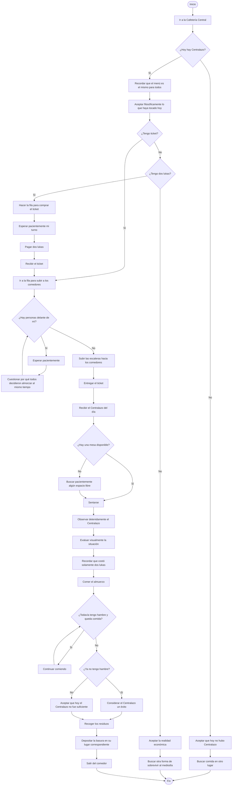
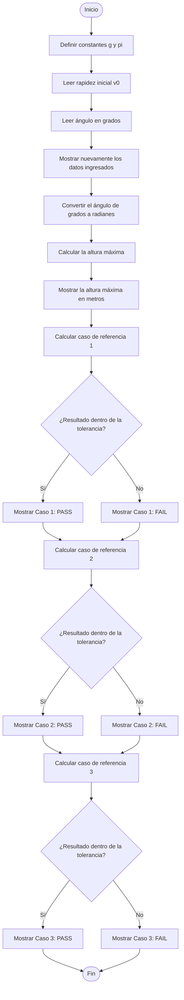

# Taller 1 - Física Computacional

## Contenido

Este directorio contiene el desarrollo del Taller 1 de Física Computacional.

### Archivos

- `README.md`: pseudocódigos, diagramas de flujo y glosario.
- `altura_maxima_proyectil.f90`: programa en Fortran para calcular la altura máxima de un proyectil bien x
- `reporte_taller_1.tex`: código fuente del reporte en LaTeX.
- `reporte_taller_1.pdf`: reporte final del taller.

---

# Punto 1 - Algoritmos cotidianos

## 1.a. Sacar *Cien años de soledad* de la Biblioteca Central

### Pseudocódigo

```text
Inicio
    Ir a la Biblioteca Central

    Verificar que la biblioteca esté en pie y completamente funcional

    Si la biblioteca está en pie y completamente funcional entonces
        Ingresar a la biblioteca
        Buscar "Cien años de soledad" en el catálogo
        Obtener la ubicación del libro
        Ir a la sección indicada
        Buscar el libro en el estante

        Si el libro está disponible entonces
            Tomar el libro
            Ir al punto de préstamo
            Presentar identificación o carné estudiantil
            Solicitar el préstamo del libro

            Si el préstamo es autorizado entonces
                Recibir el libro
                Salir de la biblioteca
            Sino
                Informar que no fue posible realizar el préstamo
            Fin Si

        Sino
            Informar que el libro no está disponible
        Fin Si

    Sino
        Llamar a los capuchos
        Hacer paro
    Fin Si
Fin
```

### Diagrama de flujo


---

## 1.b. Preparar una tortilla

### Pseudocódigo

```text
Inicio
    Reunir los ingredientes y utensilios
    Tomar los huevos

    Verificar el estado de no pudredumbre de los huevos

    Si los huevos están en buen estado entonces

        Pensar detenidamente cómo prefiero comer los huevos hoy

        Si después de una profunda reflexión sigo queriendo tortilla entonces
            Romper los huevos en un recipiente
            Agregar sal al gusto
            Batir los huevos

            Colocar una sartén en la estufa
            Agregar aceite o mantequilla
            Encender la estufa

            Verter los huevos batidos en la sartén

            Mientras la parte inferior no esté cocida
                Observar pacientemente la tortilla
                Resistir la tentación de voltearla antes de tiempo
                Continuar cocinando
            Fin Mientras

            Voltear la tortilla

            Mientras el otro lado no esté cocido
                Continuar cocinando
            Fin Mientras

            Apagar la estufa
            Retirar la tortilla de la sartén
            Servir la tortilla

            Contemplar brevemente las consecuencias de mis decisiones culinarias

        Sino
            Elegir otra preparación para los huevos
        Fin Si

    Sino
        No consumir los huevos bajo ninguna circunstancia
        Desechar los huevos
        Considerar seriamente revisar la nevera con mayor frecuencia
    Fin Si

Fin
```

### Diagrama de flujo


---
## 1.c. Almorzar en la Cafetería Central: el "Centralazo"

### Pseudocódigo

```text
Inicio
    Ir a la Cafetería Central

    Verificar que hoy haya Centralazo

    Si hay Centralazo entonces

        Recordar que el menú es el mismo para todos
        Aceptar filosóficamente lo que haya tocado hoy

        Verificar si tengo ticket

        Si tengo ticket entonces
            Ir directamente a la fila para subir a los comedores

        Sino
            Verificar si tengo dos lukas disponibles

            Si tengo dos lukas entonces
                Hacer la fila para comprar el ticket
                Esperar pacientemente mi turno
                Pagar dos lukas
                Recibir el ticket
                Ir a la fila para subir a los comedores

            Sino
                Aceptar la realidad económica
                Buscar otra forma de sobrevivir al mediodía
            Fin Si

        Fin Si

        Mientras haya personas delante de mí en la fila
            Esperar pacientemente
            Cuestionar por qué todo el mundo decidió almorzar exactamente al mismo tiempo
        Fin Mientras

        Subir las escaleras hacia los comedores
        Entregar el ticket

        Recibir el Centralazo del día

        Buscar una mesa disponible

        Si hay una mesa disponible entonces
            Sentarse
        Sino
            Buscar pacientemente algún espacio libre
        Fin Si

        Observar detenidamente el Centralazo
        Evaluar visualmente la situación
        Recordar que costó solamente dos lukas

        Comer el almuerzo

        Mientras todavía tenga hambre y quede comida
            Continuar comiendo
        Fin Mientras

        Si ya no tengo hambre entonces
            Considerar el Centralazo un éxito
        Sino
            Aceptar que hoy el Centralazo no fue suficiente
        Fin Si

        Recoger los residuos
        Depositar la basura en su lugar correspondiente
        Salir del comedor

    Sino
        Aceptar que hoy no hubo Centralazo
        Buscar comida en otro lugar
    Fin Si

Fin
```

### Diagrama de flujo



---

# Punto 2 - Altura máxima de un proyectil

## Descripción del problema

Se desea diseñar un programa en Fortran que calcule la altura máxima alcanzada por un proyectil a partir de su rapidez inicial y del ángulo de lanzamiento respecto a la horizontal.

La ecuación utilizada es:

$$
h_{\max} = \frac{v_0^2 \sin^2(\theta)}{2g}
$$

donde:

- $v_0$ es la rapidez inicial del proyectil en m/s.
- $\theta$ es el ángulo de lanzamiento.
- $g = 9.8\ \mathrm{m/s^2}$ es la aceleración de la gravedad.
- $h_{\max}$ es la altura máxima alcanzada en metros.

Debido a que la función `sin()` de Fortran recibe el ángulo en radianes, primero se debe convertir el ángulo ingresado en grados mediante:

```math
\theta_{\mathrm{rad}} = \theta_{\mathrm{grados}} \frac{\pi}{180}
```

---

## Pseudocódigo

```text
Inicio

    Definir g = 9.8
    Definir pi = 3.14159265

    Leer rapidez inicial v0
    Leer angulo_grados

    Mostrar nuevamente los datos ingresados

    Convertir el ángulo de grados a radianes

    angulo_rad <- angulo_grados * pi / 180

    Calcular la altura máxima

    h_max <- (v0^2 * sin(angulo_rad)^2) / (2 * g)

    Mostrar h_max en metros

    Realizar pruebas de verificación

    Caso 1:
        angulo = 90 grados
        v0 = 9.8 m/s
        valor esperado = 4.9000 m

        Calcular la altura

        Si la diferencia entre el resultado y el valor esperado
        está dentro de la tolerancia entonces
            Mostrar "Caso 1: PASS"
        Sino
            Mostrar "Caso 1: FAIL"
        Fin Si

    Caso 2:
        angulo = 45 grados
        v0 = 20.0 m/s
        valor esperado = 10.2041 m

        Calcular la altura

        Si la diferencia entre el resultado y el valor esperado
        está dentro de la tolerancia entonces
            Mostrar "Caso 2: PASS"
        Sino
            Mostrar "Caso 2: FAIL"
        Fin Si

    Caso 3:
        angulo = 30 grados
        v0 = 20.0 m/s
        valor esperado = 5.1020 m

        Calcular la altura

        Si la diferencia entre el resultado y el valor esperado
        está dentro de la tolerancia entonces
            Mostrar "Caso 3: PASS"
        Sino
            Mostrar "Caso 3: FAIL"
        Fin Si

Fin
```

### Diagrama de flujo



---
# Punto 3 - Glosario

## 1. Algoritmo

Un algoritmo es básicamente una serie de pasos ordenados que uno diseña para resolver un problema. La idea es que los pasos sean lo suficientemente claros como para que alguien —o en este caso un computador que no tiene la capacidad de adivinar absolutamente nada— pueda seguirlos y eventualmente llegar a un resultado.

Un algoritmo además debe terminar en algún momento; si se queda haciendo lo mismo por toda la eternidad probablemente algo salió mal.

---

## 2. Variable

Una variable es un espacio donde el programa guarda información que puede cambiar mientras se está ejecutando.

Por ejemplo, en el programa del proyectil:

```fortran
real :: v0
```

`v0` es una variable porque su valor depende de la rapidez inicial que ingrese el usuario. Hoy puede valer `20.0`, mañana `9.8`, y el computador no se va a quejar.

---

## 3. Constante

Una constante también almacena un valor, pero a diferencia de una variable, ese valor se supone que no debe cambiar durante la ejecución del programa.

En Fortran se puede declarar usando `parameter`.

Por ejemplo:

```fortran
real, parameter :: g = 9.8
```

En este programa tomamos la gravedad como `9.8 m/s²`, así que no tendría mucho sentido que cinco líneas después `g` decidiera espontáneamente convertirse en `37`.

---

## 4. Tipo de dato

El tipo de dato le indica al computador qué clase de información va a almacenar una variable y, por lo tanto, cómo debe interpretarla.

Por ejemplo:

- `integer`: números enteros.
- `real`: números con parte decimal.
- `character`: texto.
- `logical`: valores verdadero o falso.
- `complex`: números complejos.

No es lo mismo guardar el número `20` que guardar el texto `"20"`, aunque para nosotros visualmente se parezcan.

---

## 5. Diagrama de flujo

Un diagrama de flujo es una representación gráfica de un algoritmo.

En lugar de leer solamente instrucciones escritas, podemos ver cómo fluye el programa entre procesos, decisiones y posibles caminos.

Por ejemplo, un rombo puede representar una pregunta como:

> ¿Tengo ticket para el Centralazo?

y dependiendo de si la respuesta es sí o no, el algoritmo toma caminos diferentes.

Sirve bastante para darse cuenta de que el algoritmo que uno juraba que tenía perfecto en la cabeza en realidad tenía como cuatro huecos lógicos.

---

## 6. Pseudocódigo

El pseudocódigo es una manera de escribir un algoritmo utilizando lenguaje humano estructurado, sin tener que seguir todavía la sintaxis exacta de un lenguaje de programación.

Por ejemplo:

```text
Si tengo ticket entonces
    Subir al comedor
Sino
    Comprar ticket
Fin Si
```

No necesariamente compila en ningún lenguaje, pero permite organizar la lógica antes de empezar a pelearse con Fortran.

---

## 7. Entrada de datos

La entrada de datos es la información que recibe el programa para poder realizar sus cálculos.

En Fortran podemos recibir información del usuario con:

```fortran
read *, variable
```

En nuestro programa, por ejemplo, la rapidez inicial y el ángulo son datos de entrada porque el usuario los proporciona.

Sin entrada, el programa simplemente tendría que trabajar siempre con los mismos valores o intentar desarrollar poderes psíquicos.

---

## 8. Salida de datos

La salida de datos es la información que el programa devuelve después de realizar algún proceso.

En Fortran usamos, por ejemplo:

```fortran
print *, "Altura maxima = ", h_max
```

En nuestro caso, la altura máxima del proyectil es una salida.

Es básicamente el momento en el que el computador finalmente nos cuenta qué hizo con todo lo que le dimos.

---

## 9. `implicit none`

`implicit none` es una instrucción de Fortran que obliga a declarar todas las variables antes de utilizarlas.

Por ejemplo:

```fortran
implicit none

real :: velocidad
```

Esto evita que Fortran invente tipos de variables automáticamente basándose en sus nombres.

Puede parecer una molestia adicional, pero realmente evita errores bastante absurdos causados por escribir mal el nombre de una variable y no darse cuenta.

Por eso probablemente es mejor dejarle explícitamente claro al computador qué estamos haciendo.

---

## 10. Diccionario de datos

Un diccionario de datos es la parte donde se documentan las variables y constantes utilizadas en un programa.

Normalmente incluye:

- nombre;
- tipo;
- significado;
- unidades físicas, si las tiene.

Por ejemplo:

```fortran
real :: h_max
! Altura maxima del proyectil en metros
```

En física esto es especialmente importante porque poner simplemente:

```text
velocidad = 20
```

no dice gran cosa.

¿20 qué?

¿m/s?

¿km/h?

¿Mach 20?

Las unidades importan bastante si uno no quiere lanzar accidentalmente un proyectil a velocidades orbitales.

---

## 11. División entera

La división entera ocurre cuando se dividen dos valores de tipo `integer`.

El detalle peligroso es que la parte decimal simplemente desaparece.

Por ejemplo:

```fortran
5 / 2
```

si ambos números son enteros, da:

```text
2
```

y no `2.5`.

Por eso, cuando trabajamos con magnitudes físicas, normalmente conviene utilizar valores `real`:

```fortran
5.0 / 2.0
```

que sí produce:

```text
2.5
```

Es uno de esos errores donde el programa corre perfectamente y aun así uno termina preguntándose por qué la física dejó de funcionar.

---

## 12. Función intrínseca

Una función intrínseca es una función que ya viene incorporada en Fortran y que podemos utilizar directamente sin tener que programarla nosotros mismos.

Algunos ejemplos son:

```fortran
sin(x)
sqrt(x)
abs(x)
log(x)
```

En nuestro programa utilizamos:

```fortran
sin(angulo_rad)
```

para calcular el seno del ángulo.

Es básicamente aprovechar que alguien ya se tomó el trabajo de programar ciertas operaciones matemáticas para que nosotros no tengamos que reinventar el seno desde cero a las nueve de la mañana.

---

## 13. Operador lógico

Un operador lógico sirve para combinar o modificar condiciones que pueden ser verdaderas o falsas.

En Fortran algunos son:

```fortran
.AND.
.OR.
.NOT.
```

Por ejemplo:

```fortran
if (edad >= 18 .AND. tiene_documento) then
```

solo se cumple si las dos condiciones son verdaderas.

Son útiles cuando una decisión depende de más de una cosa y un simple sí o no ya no alcanza.

---

## 14. Error de sintaxis

Un error de sintaxis sucede cuando escribimos una instrucción que no respeta las reglas del lenguaje.

Por ejemplo, escribir mal una palabra reservada, olvidar cerrar algo o construir una sentencia que Fortran simplemente no entiende.

Es parecido a escribir una oración con una estructura tan rota que ya ni siquiera se puede interpretar qué se quería decir.

Normalmente el compilador detecta estos errores antes de que el programa pueda ejecutarse.

---

## 15. Error de ejecución

Un error de ejecución ocurre cuando el programa logra compilar, empieza a funcionar y luego sucede algo que le impide continuar correctamente.

Es decir, el código parecía legal hasta que efectivamente intentó hacer la barbaridad que le pedimos.

Dependiendo del programa, podría ocurrir por operaciones inválidas, problemas al leer información o situaciones que no se habían considerado.

La diferencia con un error de sintaxis es que aquí el programa sí consiguió empezar a ejecutarse.

---

## 16. Error lógico

Un error lógico es probablemente el más traicionero de los tres.

El programa:

- compila;
- corre;
- no explota;
- y aun así da una respuesta incorrecta.

Por ejemplo, si para calcular la altura máxima escribiéramos una fórmula equivocada, Fortran podría ejecutarla perfectamente porque para él la operación es válida.

El computador no sabe física y tampoco sabe qué resultado queríamos obtener. Simplemente hace exactamente lo que le pedimos, incluso cuando lo que le pedimos está mal.

Por eso usamos casos conocidos y pruebas `PASS/FAIL`: no basta con comprobar que el código corre, también hay que comprobar que está haciendo lo correcto.

---
