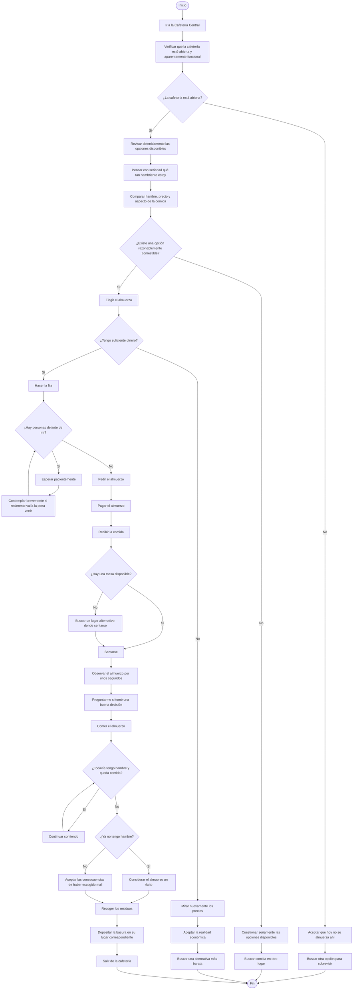

# Taller 1 - Física Computacional

## Contenido

Este directorio contiene el desarrollo del Taller 1 de Física Computacional.

### Archivos

- `README.md`: pseudocódigos, diagramas de flujo y glosario.
- `altura_maxima_proyectil.f90`: programa en Fortran para calcular la altura máxima de un proyectil bien x
- `reporte_taller_1.tex`: código fuente del reporte en LaTeX.
- `reporte_taller_1.pdf`: reporte final del taller.

---

# Punto 1 - Algoritmos cotidianos

## 1.a. Sacar *Cien años de soledad* de la Biblioteca Central

### Pseudocódigo

```text
Inicio
    Ir a la Biblioteca Central

    Verificar que la biblioteca esté en pie y completamente funcional

    Si la biblioteca está en pie y completamente funcional entonces
        Ingresar a la biblioteca
        Buscar "Cien años de soledad" en el catálogo
        Obtener la ubicación del libro
        Ir a la sección indicada
        Buscar el libro en el estante

        Si el libro está disponible entonces
            Tomar el libro
            Ir al punto de préstamo
            Presentar identificación o carné estudiantil
            Solicitar el préstamo del libro

            Si el préstamo es autorizado entonces
                Recibir el libro
                Salir de la biblioteca
            Sino
                Informar que no fue posible realizar el préstamo
            Fin Si

        Sino
            Informar que el libro no está disponible
        Fin Si

    Sino
        Llamar a los capuchos
        Hacer paro
    Fin Si
Fin
```

### Diagrama de flujo


---

## 1.b. Preparar una tortilla

### Pseudocódigo

```text
Inicio
    Reunir los ingredientes y utensilios
    Tomar los huevos

    Verificar el estado de no pudredumbre de los huevos

    Si los huevos están en buen estado entonces

        Pensar detenidamente cómo prefiero comer los huevos hoy

        Si después de una profunda reflexión sigo queriendo tortilla entonces
            Romper los huevos en un recipiente
            Agregar sal al gusto
            Batir los huevos

            Colocar una sartén en la estufa
            Agregar aceite o mantequilla
            Encender la estufa

            Verter los huevos batidos en la sartén

            Mientras la parte inferior no esté cocida
                Observar pacientemente la tortilla
                Resistir la tentación de voltearla antes de tiempo
                Continuar cocinando
            Fin Mientras

            Voltear la tortilla

            Mientras el otro lado no esté cocido
                Continuar cocinando
            Fin Mientras

            Apagar la estufa
            Retirar la tortilla de la sartén
            Servir la tortilla

            Contemplar brevemente las consecuencias de mis decisiones culinarias

        Sino
            Elegir otra preparación para los huevos
        Fin Si

    Sino
        No consumir los huevos bajo ninguna circunstancia
        Desechar los huevos
        Considerar seriamente revisar la nevera con mayor frecuencia
    Fin Si

Fin
```

### Diagrama de flujo


---
## 1.c. Almorzar en la Cafetería Central

### Pseudocódigo

```text
Inicio
    Ir a la Cafetería Central

    Verificar que la cafetería esté abierta y aparentemente funcional

    Si la cafetería está abierta entonces

        Revisar detenidamente las opciones disponibles

        Pensar con seriedad qué tan hambriento estoy
        Comparar mentalmente hambre, precio y aspecto de la comida

        Si existe una opción que parece razonablemente comestible entonces

            Elegir el almuerzo

            Verificar si tengo suficiente dinero para pagarlo

            Si tengo suficiente dinero entonces

                Hacer la fila

                Mientras haya personas delante de mí
                    Esperar pacientemente
                    Contemplar brevemente si realmente valía la pena venir
                Fin Mientras

                Pedir el almuerzo
                Pagar el almuerzo
                Recibir la comida

                Buscar una mesa disponible

                Si hay una mesa disponible entonces
                    Sentarse
                Sino
                    Buscar un lugar alternativo donde sentarse
                Fin Si

                Observar el almuerzo por unos segundos
                Preguntarme si tomé una buena decisión

                Comer el almuerzo

                Mientras todavía tenga hambre y quede comida
                    Continuar comiendo
                Fin Mientras

                Si ya no tengo hambre entonces
                    Considerar el almuerzo un éxito
                Sino
                    Aceptar las consecuencias de haber escogido mal
                Fin Si

                Recoger los residuos
                Depositar la basura en su lugar correspondiente
                Salir de la cafetería

            Sino
                Mirar nuevamente los precios
                Aceptar la realidad económica
                Buscar una alternativa más barata
            Fin Si

        Sino
            Cuestionar seriamente las opciones disponibles
            Buscar comida en otro lugar
        Fin Si

    Sino
        Aceptar que hoy no se almuerza ahí
        Buscar otra opción para sobrevivir
    Fin Si

Fin
```

### Diagrama de flujo



---
