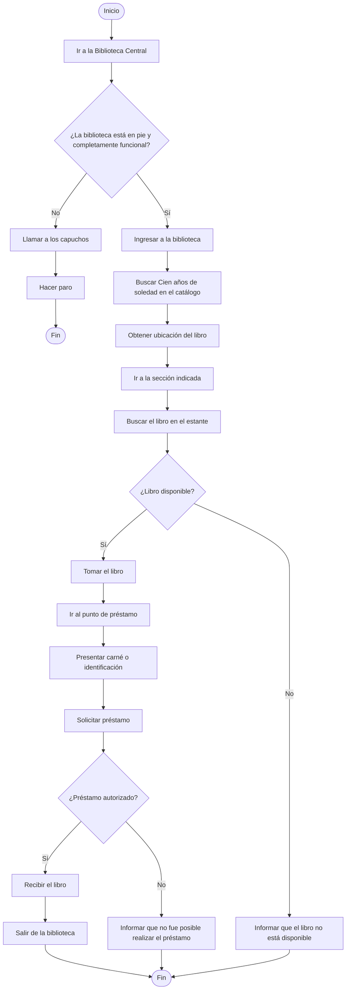
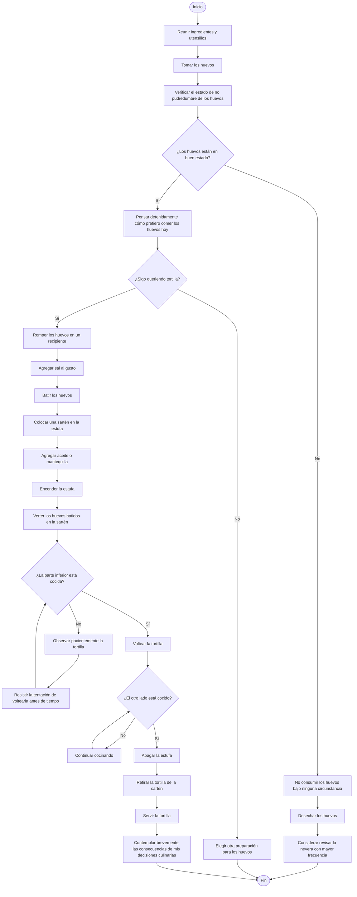
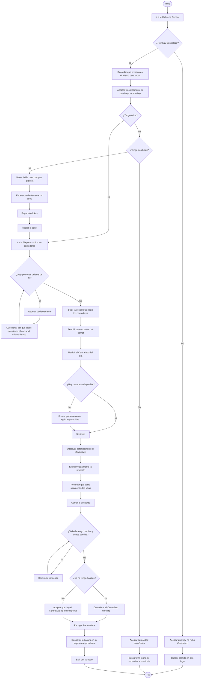

# Taller 1 - Física Computacional

## Contenido

Este directorio contiene el desarrollo del Taller 1 de Física Computacional.

### Archivos

- `README.md`: pseudocódigos, diagramas de flujo y glosario.
- `altura_maxima_proyectil.f90`: programa en Fortran para calcular la altura máxima de un proyectil bien x
- `reporte_taller_1.tex`: código fuente del reporte en LaTeX.
- `reporte_taller_1.pdf`: reporte final del taller.

---

# Punto 1 - Algoritmos cotidianos

## 1.a. Sacar *Cien años de soledad* de la Biblioteca Central

### Pseudocódigo

```text
Inicio
    Ir a la Biblioteca Central

    Verificar que la biblioteca esté en pie y completamente funcional

    Si la biblioteca está en pie y completamente funcional entonces
        Ingresar a la biblioteca
        Buscar "Cien años de soledad" en el catálogo
        Obtener la ubicación del libro
        Ir a la sección indicada
        Buscar el libro en el estante

        Si el libro está disponible entonces
            Tomar el libro
            Ir al punto de préstamo
            Presentar identificación o carné estudiantil
            Solicitar el préstamo del libro

            Si el préstamo es autorizado entonces
                Recibir el libro
                Salir de la biblioteca
            Sino
                Informar que no fue posible realizar el préstamo
            Fin Si

        Sino
            Informar que el libro no está disponible
        Fin Si

    Sino
        Llamar a los capuchos
        Hacer paro
    Fin Si
Fin
```

### Diagrama de flujo



---

## 1.b. Preparar una tortilla

### Pseudocódigo

```text
Inicio
    Reunir los ingredientes y utensilios
    Tomar los huevos

    Verificar el estado de no pudredumbre de los huevos

    Si los huevos están en buen estado entonces

        Pensar detenidamente cómo prefiero comer los huevos hoy

        Si después de una profunda reflexión sigo queriendo tortilla entonces
            Romper los huevos en un recipiente
            Agregar sal al gusto
            Batir los huevos

            Colocar una sartén en la estufa
            Agregar aceite o mantequilla
            Encender la estufa

            Verter los huevos batidos en la sartén

            Mientras la parte inferior no esté cocida
                Observar pacientemente la tortilla
                Resistir la tentación de voltearla antes de tiempo
                Continuar cocinando
            Fin Mientras

            Voltear la tortilla

            Mientras el otro lado no esté cocido
                Continuar cocinando
            Fin Mientras

            Apagar la estufa
            Retirar la tortilla de la sartén
            Servir la tortilla

            Contemplar brevemente las consecuencias de mis decisiones culinarias

        Sino
            Elegir otra preparación para los huevos
        Fin Si

    Sino
        No consumir los huevos bajo ninguna circunstancia
        Desechar los huevos
        Considerar seriamente revisar la nevera con mayor frecuencia
    Fin Si

Fin
```

### Diagrama de flujo



---
## 1.c. Almorzar en Central el intentando bendecir mi organismo con un buen Centralazo

### Pseudocódigo

```text
Inicio
    Ir a la Cafetería Central

    Verificar que hoy haya Centralazo

    Si hay Centralazo entonces

        Recordar que el menú es el mismo para todos
        Aceptar filosóficamente lo que haya tocado hoy

        Verificar si tengo ticket

        Si tengo ticket entonces
            Ir directamente a la fila para subir a los comedores

        Sino
            Verificar si tengo dos lukas disponibles

            Si tengo dos lukas entonces
                Hacer la fila para comprar el ticket
                Esperar pacientemente mi turno
                Pagar dos lukas
                Recibir el ticket
                Ir a la fila para subir a los comedores

            Sino
                Aceptar la realidad económica
                Buscar otra forma de sobrevivir al mediodía
                Fin
            Fin Si

        Fin Si

        Mientras haya personas delante de mí en la fila
            Esperar pacientemente
            Cuestionar por qué todo el mundo decidió almorzar exactamente al mismo tiempo
        Fin Mientras

        Subir las escaleras hacia los comedores
        Entregar el ticket

        Recibir el Centralazo del día

        Buscar una mesa disponible

        Si hay una mesa disponible entonces
            Sentarse
        Sino
            Buscar pacientemente algún espacio libre
        Fin Si

        Observar detenidamente el Centralazo
        Evaluar visualmente la situación
        Recordar que costó solamente dos lukas

        Comer el almuerzo

        Mientras todavía tenga hambre y quede comida
            Continuar comiendo
        Fin Mientras

        Si ya no tengo hambre entonces
            Considerar el Centralazo un éxito
        Sino
            Aceptar que hoy el Centralazo no fue suficiente
        Fin Si

        Recoger los residuos
        Depositar la basura en su lugar correspondiente
        Salir del comedor

    Sino
        Aceptar que hoy no hubo Centralazo
        Buscar comida en otro lugar
    Fin Si

Fin
```

### Diagrama de flujo



---
