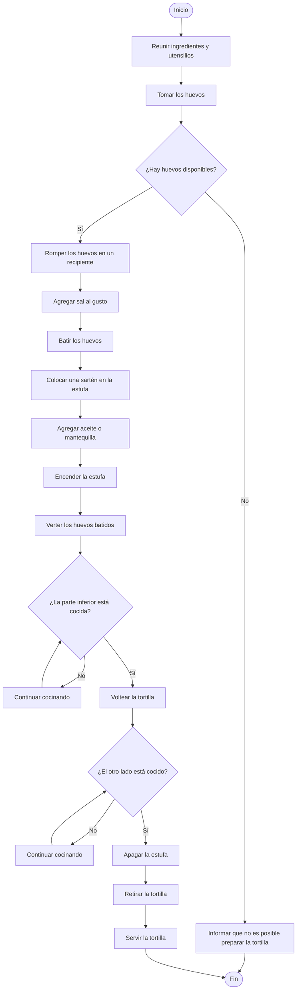

# Taller 1 - Física Computacional

## Contenido

Este directorio contiene el desarrollo del Taller 1 de Física Computacional.

### Archivos

- `README.md`: pseudocódigos, diagramas de flujo y glosario.
- `altura_maxima_proyectil.f90`: programa en Fortran para calcular la altura máxima de un proyectil bien x
- `reporte_taller_1.tex`: código fuente del reporte en LaTeX.
- `reporte_taller_1.pdf`: reporte final del taller.

---

# Punto 1 - Algoritmos cotidianos

## 1.a. Sacar *Cien años de soledad* de la Biblioteca Central

### Pseudocódigo

```text
Inicio
    Ir a la Biblioteca Central

    Verificar que la biblioteca esté en pie y completamente funcional

    Si la biblioteca está en pie y completamente funcional entonces
        Ingresar a la biblioteca
        Buscar "Cien años de soledad" en el catálogo
        Obtener la ubicación del libro
        Ir a la sección indicada
        Buscar el libro en el estante

        Si el libro está disponible entonces
            Tomar el libro
            Ir al punto de préstamo
            Presentar identificación o carné estudiantil
            Solicitar el préstamo del libro

            Si el préstamo es autorizado entonces
                Recibir el libro
                Salir de la biblioteca
            Sino
                Informar que no fue posible realizar el préstamo
            Fin Si

        Sino
            Informar que el libro no está disponible
        Fin Si

    Sino
        Llamar a los capuchos
        Hacer paro
    Fin Si
Fin
```

### Diagrama de flujo


---

## 1.b. Preparar una tortilla

### Pseudocódigo

```text
Inicio
    Reunir los ingredientes y utensilios
    Tomar los huevos

    Si hay huevos disponibles entonces
        Romper los huevos en un recipiente
        Agregar sal al gusto
        Batir los huevos

        Colocar una sartén en la estufa
        Agregar aceite o mantequilla
        Encender la estufa

        Verter los huevos batidos en la sartén

        Mientras la parte inferior no esté cocida
            Continuar cocinando
        Fin Mientras

        Voltear la tortilla

        Mientras el otro lado no esté cocido
            Continuar cocinando
        Fin Mientras

        Apagar la estufa
        Retirar la tortilla de la sartén
        Servir la tortilla

    Sino
        Informar que no es posible preparar la tortilla
    Fin Si
Fin
```

### Diagrama de flujo


